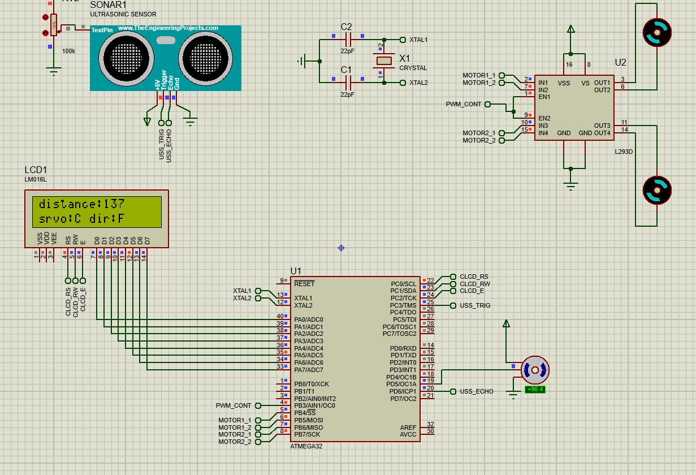

## this project is submited to [AMIT LEARNING](https://www.amit-learning.com/home)

### In a nutshell the project is an autonomous car that detect obstacles and avoid them.

# The project in action 🚗


# Proteus simulation ⚙



# Flow chart 📄


# Ultra Soncic Sensor (**_HC-SR04_**) 🔦👓

### Ultrasonic is placed on servo motor axis, its function to detect the obstacles on the car way.

### If the car found an obstacle, it must change its way according to the ultrasonic data

## ⚠ Notice the code below is just demonstarion not the acutal code to run the process

ATmega16 microcontroller needs to transmit a 10 us trigger pulse to the HC-SR04 Trig Pin.

```
    DIO_u8SetPinValue(USS_u8_TRIGGER_PORT, USS_u8_TRIGGER_PIN, DIO_u8_PIN_HIGH);
	_delay_us(10);
	DIO_u8SetPinValue(USS_u8_TRIGGER_PORT, USS_u8_TRIGGER_PIN, DIO_u8_PIN_LOW);

```

After getting a trigger pulse, HC-SR04 (USS) sends eight 40 kHz sound waves and. When the sound waves are sent the USS the output at the Echo pin gets raised. So we wait for the rising edge with the uc (ATMEGA32). We capture the falling edge using **input capute mode** found and pin PD6(ICP1).

```
setICP_RisingEdge(); /* set input captre mode to Rising edge at ICP1 */
while ((TIFR & (1 << TIFR_ICF1)) == 0); /* wait for Rising edge */
```

When the rising edge captured , start Timer of the uc(ATMEGA32) and again wait for a falling edge on the Echo pin. The input caputue mode is changed to capture falling edge.

```
setICP_FallingEdge(); /* set capture on falling edge and start timer */
while ((TIFR & (1 << TIFR_ICF1)) == 0);/* Wait for falling edge */

```

As soon as the falling edge is captured at the Echo pin. We caluclate the distance using the counted time with number of occured overflows.

```
/*
		this calculation is based on the used crystal oscillator
		which is 16 MHZ
		 distance in cm = 17150 * TIMER
		 = 17150 x (TIMER value) x 0.0625 x 10^-6 cm
		 = (TIMER value) * (0.343 / 320)
		 = 1/923.94

		 trigger pin DIO_u8_PORTA
		 */

	/* current count */
	uint32 count  = ICR1L;
	count = count | (ICR1H << 8);

	count += TIMER1_MAX_COUNT * TIMER1_OVER_FLOW;

	return (uint32)((float32)count / 923.94); /* distance */
```

# CLCD (**_LM016L_**)📺

LCD is used to display the distance between the car and the object the USS pointing at, display the current direction of the Servo motor, and the car moving state (Forward **F**, Backward Right **BR**, Backward Left **BL**, Rotating around it self **RR**)


### sending a command 📤

🔔 Notice below in the CLCD configration file you can configure the number of pins you could use to control the LCD.
either **FOUR_BIT** mode, or **EIGHT_BIT** mode.

```
void CLCD_voidSendCommand(uint8 Copy_u8Command)
{
	/*Set Rs pin to low for command*/
	DIO_u8SetPinValue(CLCD_u8_CTRL_PORT,CLCD_u8_RS_PIN,DIO_u8_PIN_LOW);

	/*set RW pin to low for write*/
	DIO_u8SetPinValue(CLCD_u8_CTRL_PORT,CLCD_u8_RW_PIN,DIO_u8_PIN_LOW);

#if CLCD_u8_MODE == EIGHT_BIT
	/*send the command*/
	DIO_u8SetPortValue(CLCD_u8_DATA_PORT,Copy_u8Command);

	SendEnablePulse();
#elif CLCD_u8_MODE == FOUR_BIT
	SetDataPins(Copy_u8Command >> 4);
	SendEnablePulse();
	SetDataPins(Copy_u8Command);
	SendEnablePulse();
#endif
}
```

To initalialize the CLCD we send a certain command to the uc implemented in the CLCD module.

```
CLCD_voidSendCommand(0b00111000);
```

# Motor - H-Bridge (**_L298N_**) 🏍

Every motor in the code is an instance of a struct.

```
// every instance would take 16 bits = 2 bytes
struct Motor{
	uint8 motor_u8_port 		: 4;
	uint8 motor_u8_pin1 		: 4;
	uint8 motor_u8_pin2 		: 4;
};
```

In this case I have 2 motors to control. That are connected to a single H-bridge (**L298N**) to drive both motor and control their speed using **PWM** .

### PWM \_ \_ \_ _ |---|_ \_ \_ _ |---|_ \_ _ |---|_ \_ \_

PWM is used to control the **_speed of the motors_**.
In this program Timer0 is configured to generate PWM signal at **OC0** (**PB3**).

```
	/* Timer 0 configration */
	/* fast PWM mode */
		SET_BIT(TCCR0,TCCR0_WGM00);
		SET_BIT(TCCR0,TCCR0_WGM01);
	/* inverted PWM mode */
		SET_BIT(TCCR0,TCCR0_COM00);
		SET_BIT(TCCR0,TCCR0_COM01);
	/* no prescale */
		SET_BIT(TCCR0,TCCR0_CS00);
```

Control of PWM Duty cycle.

```
void PWM0_VoidSetDutyCycle(uint8 Copy_u8DutyCycle){
	// on time
	OCR0 = 255 - ((float32)Copy_u8DutyCycle / 100.0f) * 255.0f;
}
```

controlling direction of the motor

```
	switch(Copy_u8Dirction){
	case MOTOR_u8_CLOCKWISE:
		DIO_u8SetPinValue(Copy_Motor.motor_u8_port, Copy_Motor.motor_u8_pin1, DIO_u8_PIN_LOW);
		DIO_u8SetPinValue(Copy_Motor.motor_u8_port, Copy_Motor.motor_u8_pin2, DIO_u8_PIN_HIGH);
		break;
	case MOTOR_u8_ANTICLOCKWISE:
		DIO_u8SetPinValue(Copy_Motor.motor_u8_port, Copy_Motor.motor_u8_pin2, DIO_u8_PIN_LOW);
		DIO_u8SetPinValue(Copy_Motor.motor_u8_port, Copy_Motor.motor_u8_pin1, DIO_u8_PIN_HIGH);
		break;
    }
```

# Servo Motor (**_SG90_**)♾

The servo motor driver it written in the easiest way possible.
By calculting the amount of delay required to rotate to a certain angle using some math. The motor is rotated to the given angle value.

```
void SERVO_voidRotateToAngle(uint8 Copy_u8AngleValue){
	float32 Local_DelayValue = (1009.0f * (float32)Copy_u8AngleValue) / 50.0;
	DIO_u8SetPinValue(SERVO_u8_PORT, SERVO_u8_PIN, DIO_u8_PIN_HIGH);
	_delay_us(Local_DelayValue);
	DIO_u8SetPinValue(SERVO_u8_PORT, SERVO_u8_PIN, DIO_u8_PIN_LOW);
}
```

## Bigger view of the whole project 🤓

The **Amit** avr board is used as a flashing module to the uc (ATMEGA32). And the whole project is done on a bread board. A 16 MHZ exteran clock is connected to the uc (ATMEGA32).

